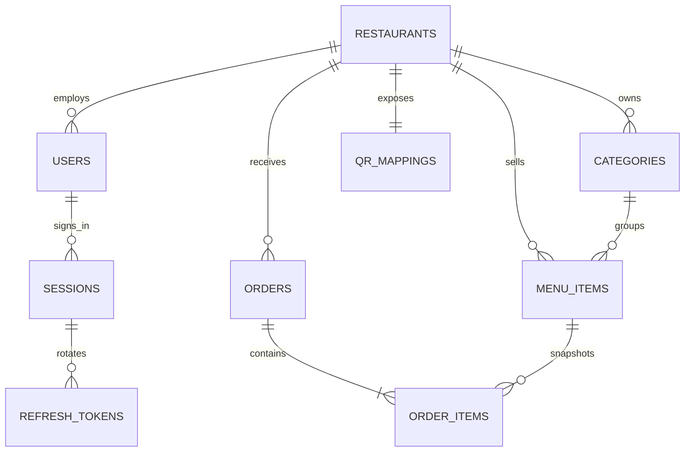

# QRasoi data model

```mermaid
erDiagram
  RESTAURANTS ||--o{ USERS : employs
  RESTAURANTS ||--o{ CATEGORIES : owns
  RESTAURANTS ||--o{ MENU_ITEMS : sells
  RESTAURANTS ||--o{ ORDERS : receives
  RESTAURANTS ||--|| QR_MAPPINGS : exposes
  USERS ||--o{ SESSIONS : signs_in
  SESSIONS ||--o{ REFRESH_TOKENS : rotates
  ORDERS ||--|{ ORDER_ITEMS : contains
  MENU_ITEMS ||--o{ ORDER_ITEMS : snapshots
  CATEGORIES ||--o{ MENU_ITEMS : groups
```
